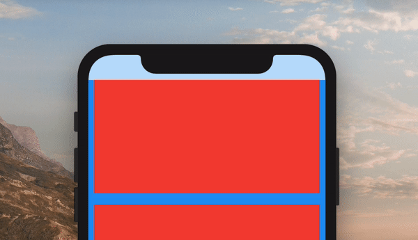

# ColorfulSafeArea

[](https://pub.dev/packages/colorful_safe_area)

A more customizable replacement for the ```SafeArea``` widget. It lets you set the color of your ```SafeArea``` without affecting the color of its child.  

<p align="center">

</p>

Use it just like a regular ```SafeArea``` widget

```dart
Scaffold(
    body: ColorfulSafeArea(
    child: SomeWidget(),
    ),
);
```

## Setting Color

The color of ```ColorfulSafeArea``` widgets are transparent by default. To change their color, set the ```color``` property.

```dart
Scaffold(
    body: ColorfulSafeArea(
    color: Colors.red,
    child: SomeWidget(),
    ),
);
```

## Using Transparent Colors

You can use any color that has transparency

```dart
Scaffold(
    body: ColorfulSafeArea(
    color: Colors.red.withOpacity(0.7),
    child: SomeWidget(),
    ),
);
```

## Overflow Rules

If you are using a transparent color and want the child of the ```ColorfulSafeArea``` to appear behind it, you can set ```overflowRules``` to define how the ```ColorfulSafeArea```'s child should appear.  The default value is ```OverflowRules.all(false)```.  The ```OverflowRules``` class works much like ```EdgeInsets```

```dart
// allows the child to overflow behind all sides
overflowRules: OverflowRules.all(true)

// allows the child to overflow only on the left and bottom sides
overflowRules: OverflowRules.only(left: true, bottom: true)

// allows the child to overflow on the top and bottom
overflowRules: OverflowRules.symmetric(vertical: true)
```

## Blurring Overflow Area

If you want to apply a blur effect to the ```ColorfulSafeArea```, you can apply a filter.

```dart
Scaffold(
    body: ColorfulSafeArea(
    overflowRules: OverflowRules.all(true),
    filter: ImageFilter.blur(sigmaX: 10, sigmaY: 10),
    child: SomeWidget(),
    ),
);
```

## Making Overflow Area Interactive

When you set ```overflowRules``` and would like for the parts of the child that have overflowed to be interactable behind the ```ColorfulSafeArea```, you can set ```overflowTappable``` to ```true```.  

```dart
Scaffold(
    body: ColorfulSafeArea(
    overflowRules: OverflowRules.all(true),
    overflowTappable: true
    child: SomeWidget(),
    ),
);
```